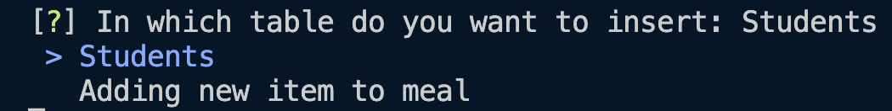
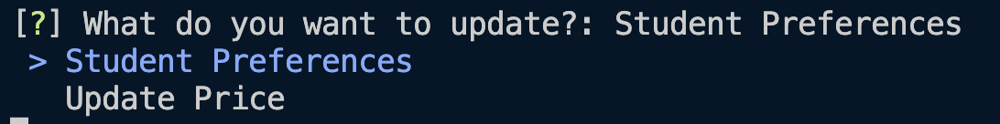
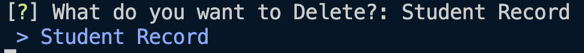
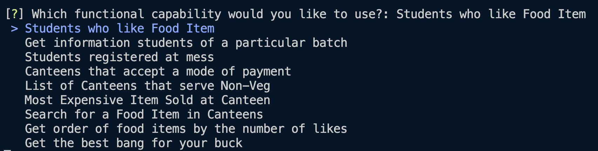

# Project Phase 4

# Project Overview

Our database tries to encapusulate the food situation on campus, from the different messes and canteens, to a students likes and dislikes, and so on. In the project’s final phase, we were made to set up the database in mysql, populate the database and finally develop a python CLI tool to interface with the mysql database. 

Using the python CLI we were able to implement a variety of commands that the user can perform on our database. The commands were divided into 4 subsections : `Update,Insert,Delete and Functional Queries`. 

The following is the overview of each of the commands implemented

https://user-images.githubusercontent.com/97172421/205387085-f6f2f09a-4eb3-41c9-915e-29fea2032ca1.mp4

# Insert

Queries that allow the insertion of records into a table of the database

### Students

This command simply provides the user the means to add a new student record to a database. Users are required to input the student’s Name, Roll Number, Mess and Canteen Preferences. The other 2 attributes of the table Batch and Programme are derived attributes and are derived from the Roll Number.

### Adding new item to a meal

This command is to allow to insertion of a new item for a particular meal in the database

# Update

Queries that allow the updation of records of the database

### Student Preferences

This allows the user to update the preferences of a particular student

### Update Price

This provides a facility for the changing of prices in the canteen.

# Delete

Only 1 deletion query has been implemented for this project

### Student Record

Allows for the deletion of the student record.

# Functional

These are the functional queries that were implemented

### Students who like food item

This command allows the user to get the list of students who like a particular food item at a particular canteen

### Get information of students belonging to a particular batch

Returns the Name, Roll Number, Mess and Canteen Preferences of all the students belonging to a particular batch.

### Students Registered at a Mess

Returns the names and roll numbers of all students who are registered at a particular mess for atleast 1 meal

### Canteens that accept a mode of payment

Returns the list of cateens that accept a specified mode of payment

### List of canteens that serve non-veg

Gets all the canteens that serve non-veg items

### Most Expensive item sold at a Canteen

Returns the most expensive item sold at the canteen specified by the user

### Search for a food item at a particular item

Allows the user to find all food items that atleast partially match the given search term

### Get order of food items by number of likes

Returns the list of food items in the descending order of their likes

### Get the best bang for your buck

A command that allows the user to input how much money they are willing to spend and returns the combination of food items from canteens that have the most number of likes.

The 0-1 knapsack DP algorithmn was used to get the optimum combinations of food items.

